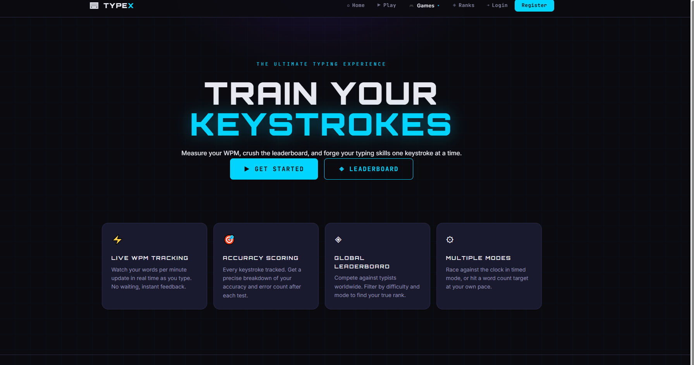

## 📝 README.md

```markdown
# ⌨️ Typing Master — ASP.NET Core MVC Typing Test & Games

A feature-rich typing practice app built with **ASP.NET Core 8 MVC** that helps you improve speed and accuracy through a classic typing test plus engaging mini-games: **Word Drop**, **Word Sniper**, and **Chain Mode**. Includes **user accounts** and a **live leaderboard/ranking** system.


---

## 🎮 Game Modes

### 🔤 Typing Test
Take a timed typing challenge with sample passages. Track your **WPM (Words Per Minute)** and **accuracy (%)** in real time as you type.

### 🔽 Word Drop
Words fall from the top of the screen—type them before they reach the bottom! Test your reflexes and endurance in this fast-paced challenge.

### 🎯 Word Sniper
Words appear as moving targets. Type them to "shoot" them down before they escape. Combines typing speed with aiming precision.

### 🔗 Chain Mode
Type consecutive words to build a chain. The longer your chain, the higher your score—mistakes instantly end your streak

### 🏎️ Word Racer
Race against a speeding car by typing the displayed word before the car reaches the finish line.  
If you type the word correctly in time, you win the race — but if the car reaches the end first, it's game over!

This mode tests:
- ⚡ Typing speed under pressure  
- 🎯 Accuracy  
- 🧠 Quick word recognition  
- 🏁 Reaction time  

The faster and more accurate you type, the better your chances of beating the car!

---

## ✨ Key Features

- 📊 **Real-time WPM & Accuracy** tracking during tests  
- 🧑‍💻 **User Accounts** — sign up, login, and manage profiles  
- 🏆 **Global Leaderboard / Ranking** — compete with other players  
- 🔥 **Combo / Chain System** with score multipliers  
- 🎨 **Responsive UI** — works seamlessly on desktop and mobile  
- 💾 **Data Persistence** — all scores and user data stored in SQL Server via Entity Framework Core  
- 🔐 **Secure Authentication** — ASP.NET Core Identity integration  

---

## 🧱 Tech Stack

| Layer | Technology |
|---|---|
| **Framework** | ASP.NET Core 8 MVC |
| **Language** | C# |
| **Database** | SQL Server |
| **ORM** | Entity Framework Core (EF Core 8) |
| **Authentication** | ASP.NET Core Identity |
| **Frontend** | HTML5, CSS3, JavaScript (Vanilla/jQuery) |
| **View Engine** | Razor Pages / MVC Views |

---

## 🚀 Getting Started

### Prerequisites

- [.NET 8 SDK](https://dotnet.microsoft.com/download/dotnet/8.0) or later
- [SQL Server 2019+](https://www.microsoft.com/en-us/sql-server/sql-server-downloads) (or SQL Server Express) running locally or remotely
  - *(Alternative: Use LocalDB which comes with Visual Studio)*
- [Visual Studio 2022](https://visualstudio.microsoft.com/) or [VS Code](https://code.visualstudio.com/)
- Git

### Installation

1. **Clone the repository**
   ```bash
   git clone https://github.com/adebusola12/typing-master.git
   cd typing-master
   ```

2. **Restore NuGet packages**
   ```bash
   dotnet restore
   ```

3. **Configure the database connection**
   - Open `appsettings.json` in your project root
   - Update the `DefaultConnection` string to point to your SQL Server instance:
   
   ```json
   {
     "ConnectionStrings": {
       "DefaultConnection": "Server=localhost;Database=TypingMasterDb;Trusted_Connection=True;TrustServerCertificate=True;"
     },
     "Logging": {
       "LogLevel": {
         "Default": "Information"
       }
     },
     "AllowedHosts": "*"
   }
   ```
   
   **Connection String Examples:**
   - **Local SQL Server (Windows Auth):** `Server=localhost;Database=TypingMasterDb;Trusted_Connection=True;TrustServerCertificate=True;`
   - **Local SQL Server (SQL Auth):** `Server=localhost;Database=TypingMasterDb;User Id=sa;Password=YourPassword;TrustServerCertificate=True;`
   - **SQL Server Express (LocalDB):** `Server=(localdb)\\mssqllocaldb;Database=TypingMasterDb;Trusted_Connection=True;`

4. **Apply database migrations**
   ```bash
   dotnet ef database update
   ```
   
   Or if using **Visual Studio Package Manager Console**:
   ```powershell
   Update-Database
   ```

5. **Run the application**
   ```bash
   dotnet run
   ```
   
   The app will start at `https://localhost:7000` (HTTPS) or `http://localhost:5000` (HTTP).  
   Open your browser and navigate to the URL shown in the terminal.

6. **Create a test account** *(optional)*
   - Click **"Register"** and create a new account to explore user accounts and the leaderboard.

---

## 📁 Project Structure

```
typing-master/
├── Controllers/           # MVC Controllers (Home, Account, Game, Leaderboard, etc.)
├── Models/               # Data models & ViewModels
├── Views/                # Razor Pages (.cshtml files)
├── Data/                 # DbContext & migrations
├── Services/             # Business logic (GameService, UserService, etc.)
├── wwwroot/             # Static files (CSS, JS, images)
├── appsettings.json     # App configuration & connection string
├── Program.cs           # Startup configuration
└── README.md            # This file
```

---

## 📸 Screenshots

`)*

---

## 🏆 Features in Detail

### User Accounts & Authentication
- Secure registration and login using **ASP.NET Core Identity**
- Password hashing and validation
- User profiles with display names and stats
- Role-based access control (optional: admin panel for moderation)

### Leaderboard & Ranking
- **Global Leaderboard** — top players by WPM, accuracy, or total games
- **Weekly / Monthly Leaderboards** — rotating challenges
- **Personal Statistics** — track your improvement over time
- Sortable by WPM, accuracy, chain score, or games played

### Game Data Persistence
- Every game result is saved to the database
- Track progress, streaks, and personal bests
- Review past game history and performance trends

---

## 🔧 Development Tips

### Adding a new migration after model changes:
```bash
dotnet ef migrations add YourMigrationName
dotnet ef database update
```

### Resetting the database (development only):
```bash
dotnet ef database drop
dotnet ef database update
```

### Debugging in Visual Studio:
- Press `F5` or **Debug → Start Debugging** to run with the debugger attached
- Set breakpoints by clicking in the left margin of your code

### Useful .NET CLI commands:
```bash
dotnet build                 # Build the project
dotnet clean                 # Clean build artifacts
dotnet test                  # Run unit tests (if added)
dotnet publish               # Publish for production
```

---

## 🗺️ Roadmap & Future Enhancements

- [ ] **Friends System** — add/challenge friends  
- [ ] **Daily Challenges** — limited-time daily tasks with rewards  
- [ ] **Custom Word Lists** — let users create/import custom words  
- [ ] **Achievements & Badges** — unlock badges for milestones  
- [ ] **Sound Effects & Themes** — audio feedback and UI themes  
- [ ] **Mobile App** — native mobile version (React Native / Flutter)  
- [ ] **Public Demo** — deploy to Azure App Service, Railway, or Fly.io  
- [ ] **API Endpoints** — RESTful API for external integrations  

---

## 🤝 Contributing

Contributions are welcome! If you'd like to improve this project:

1. Fork the repository
2. Create a feature branch (`git checkout -b feature/your-feature-name`)
3. Commit your changes (`git commit -m 'Add your feature'`)
4. Push to the branch (`git push origin feature/your-feature-name`)
5. Open a Pull Request

---

## 📄 License

This project is licensed under the **MIT License** — see the LICENSE file for details.

---

## 🆘 Troubleshooting

### "Connection string not found" error
- Make sure `appsettings.json` is in the project root and contains a valid `ConnectionStrings` section
- Verify your SQL Server instance is running

### "Database migration failed"
- Check your connection string is correct
- Ensure SQL Server is accessible from your machine
- Try running `dotnet ef database drop` and `dotnet ef database update` again

### Port already in use
- Change the port in `appsettings.json` or `Properties/launchSettings.json`
- Or kill the process using the port:
  ```bash
  # Windows: netstat -ano | findstr :5000
  # macOS/Linux: lsof -i :5000
  ```

---

## 👨‍💻 Author

**adebusola12**  
GitHub: [@adebusola12](https://github.com/adebusola12)  

---

⭐ **If you find this project helpful, please give it a star!** It helps others discover the project and motivates continued development.

---

## 📧 Questions or Feedback?

Feel free to open an **Issue** on GitHub with questions, bug reports, or feature requests!
```

---

# 

---

